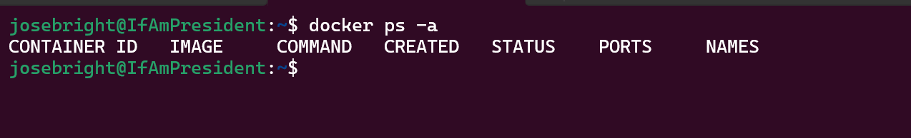
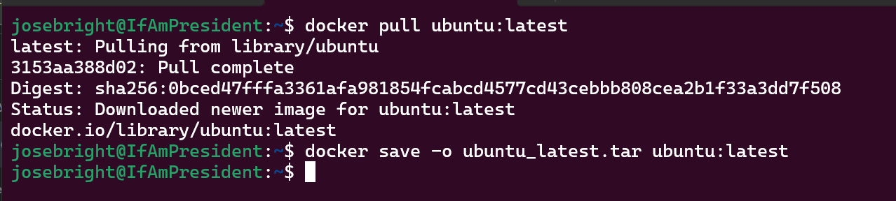
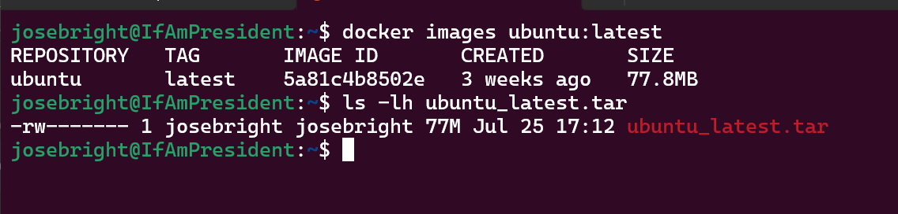

# Containers Lab - Docker

## Task 1: Container Management

1. List Containers:
   `docker ps` || `docker container ls`
   

2. Pull Latest Ubuntu Image:
   `docker pull ubuntu`

3. Run Container:
   `docker run -i -t ubuntu:latest /bin/bash`
   

4. Remove Image:
   `docker image rm -f 5a81c4b8502e`
   

## Task 2: Image and Container Operations

To earn an additional 4 points, follow these steps for image and container operations:

1. Create Image Archive:

   - Pull the latest Ubuntu image and create an archive file from it.
   - Document the commands used in a Markdown file named "ImageArchive.md" in the lab folder.
   - Compare the size of the archive file with the size of the original image. Explain any differences, if present in the same "ImageArchive.md" file.

2. Run Nginx Container:

   1. Document the output of all the commands in the tasks, along with your findings and observations.
   2. Use the appropriate command to run a container using the Nginx web server image:

      - Bind the container's port 80 to the local port 80.
      - Run the container in detached mode and name it "nginx_container".
      - Verify that the web server is running and accessible from the local machine.

   3. Create HTML File:

      - Create an HTML file with the specified content:

      ```html
      <html>
        <head>
          <title>The best</title>
        </head>
        <body>
          <h1>website</h1>
        </body>
      </html>
      ```

      - Copy the HTML file to the container at the appropriate location to serve as an index file.

   4. Create Custom Image:

      - Create a custom Docker image from the running container and name it "my_website".
      - Tag the container with the "latest" tag.

   5. Remove Original Container:

      - Remove the original container (nginx_container) and verify that it has been successfully removed.

   6. Create New Container:

      - Create a new container using the custom image you've created (the same way as the original container).

   7. Test Web Server:

      - Use the `curl` command to access the web server at `127.0.0.1:80`.

   8. Analyze Image Changes:
      - Use the `docker diff` command to analyze the changes made to the new image.
      - Explain the output of the `docker diff` command.

### Guidelines

- Use proper Markdown formatting and structure for the documentation files.
- Organize the files within the lab folder using appropriate naming conventions.
- Create a Pull Request to the main branch of the repository with your completed lab assignment.

> Note: Actively explore Docker container management and image operations to gain practical experience with containerization.
