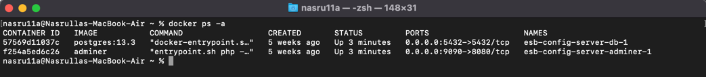
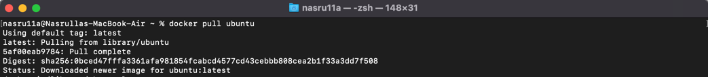
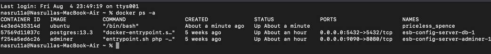
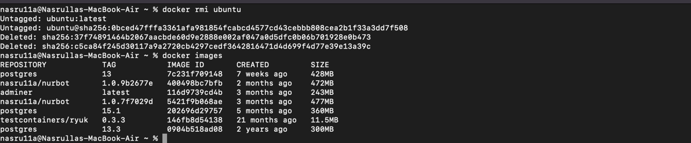

# Docker commands

### 1. List Containers:
    docker ps -a

### 2. Pull Latest Ubuntu Image:
    docker pull ubuntu

### 3. Run Container:
    docker run -ti --rm ubuntu /bin/bash

### 4. Remove Image:
    docker rmi ubuntu
