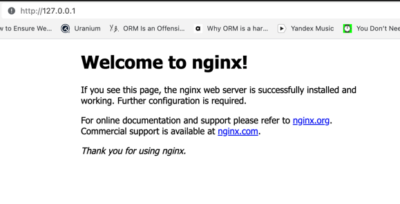

### Task 2: Image and Container Operations

## Create Image Archive


## Run Nginx Container:
> docker pull nginx

### 1. Bind the container's port 80 to the local port 80.


> docker run -p 80:80 nginx

-p 80:80 maps port 80 of the host machine to port 80 of the container. This allows you to access the Nginx web server running inside the container via http://localhost.


### 2. Run the container in detached mode and name it "nginx_container".

> docker run -d -p 80:80 --name my_nginx nginx

-d runs the container in detached mode (in the background).

--name my_nginx assigns a custom name "my_nginx" to the container for easy reference.
nginx at the end is the name of the image you want to run the container from.

### 3. Verify that the web server is running and accessible from the local machine.





## Create HTML File
> docker cp index.html nginx_container:/usr/share/nginx/html/


## Create Custom Image

With the tag latest

> docker commit nginx_container my_website:latest

## Remove Original Container

> docker rm nginx_container

## Create New Container
> docker commit nginx_container my_website:latest


## Test Web Server

> curl 127.0.0.1:80

```sh
<html>
<head>
<title>The best</title>
</head>
<body>
<h1>website</h1>
</body>
</html>
```
