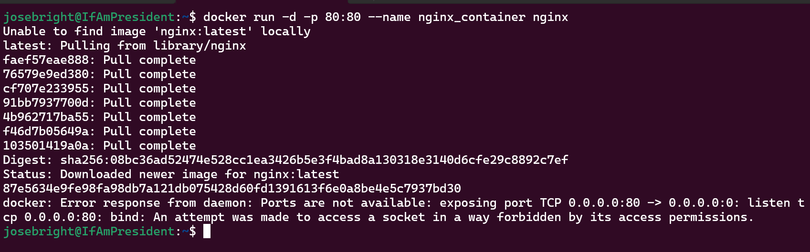
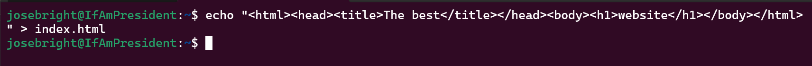
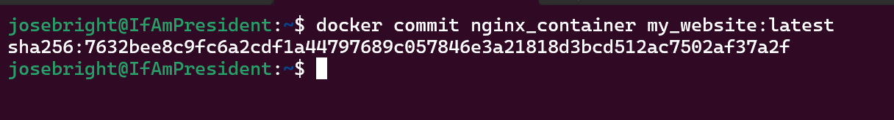
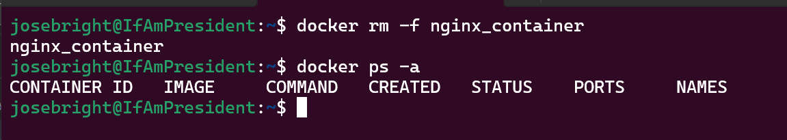
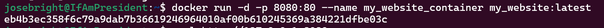
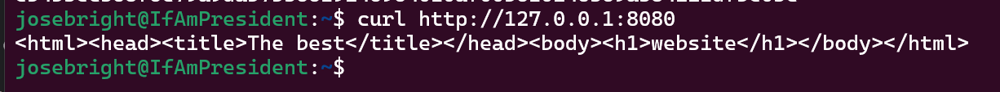
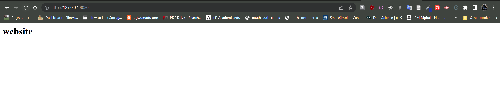
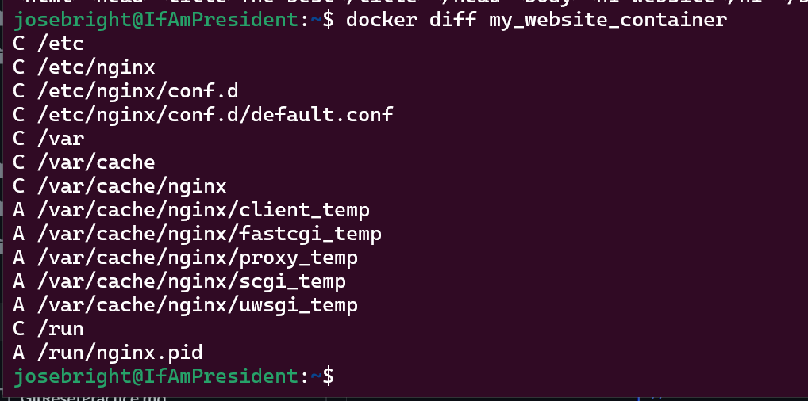

## To Create Image Archive
To pull the latest Ubuntu image and create an archive file from it, I used the commands:
```
# Pull the latest Ubuntu image
docker pull ubuntu:latest

# Save the image as an archive
docker save -o ubuntu_latest.tar ubuntu:latest
```


##  Compare Image Archive Size
To compare the size of the archive file with the size of the original image, I used the command:
```
# Check the size of the original Ubuntu image
docker images ubuntu:latest

# Check the size of the archive file
ls -lh ubuntu_latest.tar
```

**Comment**: There was no much difference in the size between the two images as seen in the above image.

## Running Nginx Container
I used the following command to run a container using the Nginx web server image, bind the container's port 80 to the local port 80, and run the container in detached mode with the name "nginx_container":
```
docker run -d -p 80:80 --name nginx_container nginx
```


The above error message indicates that there is a port conflict when trying to bind the container's port 80 to the local port 80. This error occurs because another process on the host system is already using port 80, and Docker cannot bind the container's port to it.

- To resolve this issue, I used a different host port 8080, because the port 80 is assigned to a database that I don't want to stop.

## Creating HTML File
Create an HTML file named "index.html" with the specified content with the below command:
```
echo "<html><head><title>The best</title></head><body><h1>website</h1></body></html>" > index.html
```


## Copy HTML File to Container
Copy the HTML file to the running container at the appropriate location to serve as an index file. I used the command:
```
docker cp index.html nginx_container:/usr/share/nginx/html/index.html
```


## Creating Custom Image
To create a custom Docker image from the running container and name it "my_website," I used the command:
```
docker commit nginx_container my_website:latest
```


## Removing Original Container
To remove the original container (nginx_container) and verify that it has been successfully removed, I used the commands:
 ```
docker rm -f nginx_container

# To verify that the container is removed
docker ps -a
```


## Creating a New Container
To create a new container using the custom image I have created (my_website) with the "latest" tag, I used the command:
```
 docker run -d -p 8080:80 --name my_website_container my_website:latest
```


## Testing the Web Server
To test the web server, I used the the curl command to access the web server at 127.0.0.1:80 and verify that the HTML content is served correctly.
```
curl http://127.0.0.1:8080
```



## Analyzing the Image Changes
I used the docker diff command to analyze the changes made to the new image.
```
docker diff my_website_container
```


### The docker `diff command` provides a useful summary of the changes made to the container's file system, which can be helpful for understanding what modifications have been applied during the container's runtime. Below are the representations of the different types of changes by single letters:

- `A` : File or directory has been Added
- `D` : File or directory has been Deleted
- `C` : File or directory has been Changed