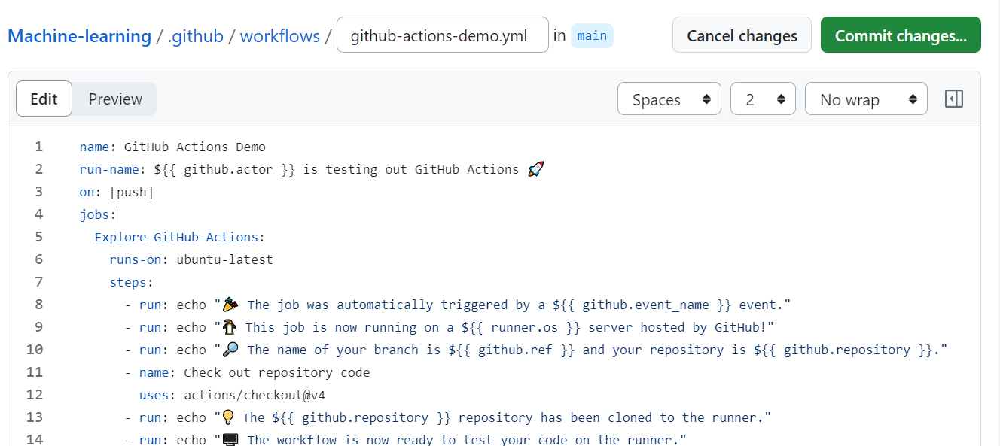
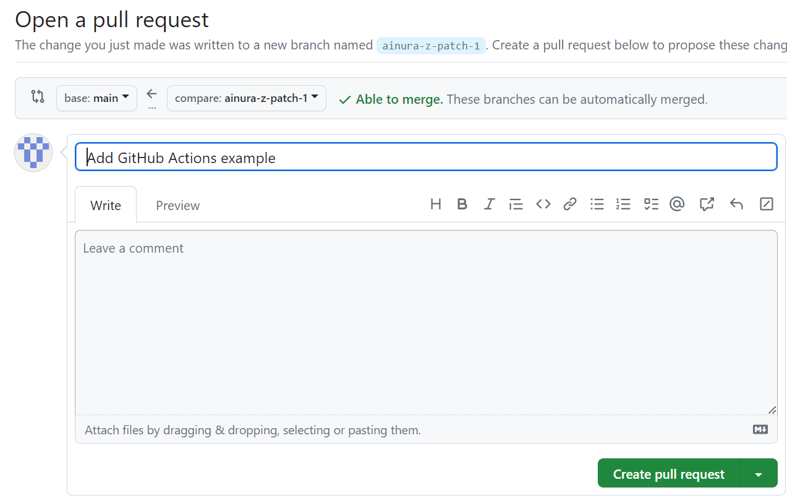
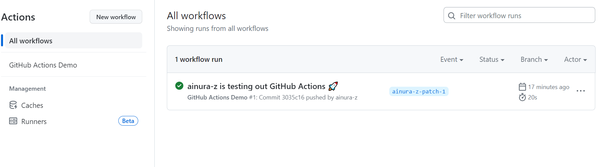
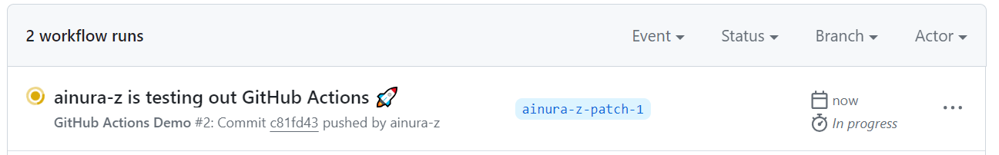
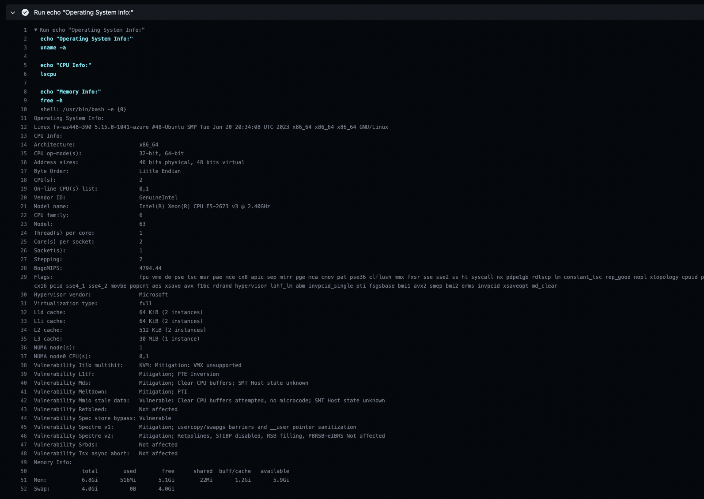

# Task 1: Create your First GitHub Actions Pipeline

1. **Reading the Official Guide**

    1. I created a `.github/workflows` directory and then I created `github-actions-demo.yml` file inside thus directory.

        

    2. After that I created a new branch for this commit and started a pull request. 

        

    3. Committing the workflow file to a branch triggered the push event and ran the workflow.

        

    **Key concepts:**

        
    _Workflow_ : A predefined automated procedure, outlined in a YAML document, detailing the CI/CD (Continuous Integration/Continuous Deployment) sequence for a given project.

    _Job_ : A collection of related steps carried out on a consistent runner, typically designated to complete a distinct task within the overarching workflow. 

    _Step_: A singular activity or procedure within a job. This could involve executing a script, running tests, or deploying software.

    _Runner_: This is the operational setting in which jobs are executed.

    _Event_: Certain actions or occurrences that initiate a workflow, which include activities like code pushes, initiating pull requests, and creating issues, among others.

    _Artifact_: These are files or a group of files produced during a workflow that can be retained and later utilized in following jobs. 

    _Workflow Dispatch_: A feature enabling the manual activation of a workflow through the GitHub API.

2. **Observing the Workflow Execution**

    I pushed some changes to my repository and the workflow started running automatically, because the push event triggers the "GitHub Actions Demo" workflow defined in github-actions-demo.yml.
        
    

    The logs of the executed workflow are the following:
    
    ```
    2023-10-27T14:44:19.7366280Z Requested labels: ubuntu-latest
    2023-10-27T14:44:19.7366436Z Job defined at: ainura-z/Machine-learning/.github/workflows/github-actions-demo.yml@refs/heads/ainura-z-patch-1
    2023-10-27T14:44:19.7366527Z Waiting for a runner to pick up this job...
    2023-10-27T14:44:20.3708426Z Job is waiting for a hosted runner to come online.
    2023-10-27T14:44:23.4294112Z Job is about to start running on the hosted runner: GitHub Actions 1 (hosted)
    2023-10-27T14:44:25.5196033Z Current runner version: '2.311.0'
    2023-10-27T14:44:25.5224810Z ##[group]Operating System
    2023-10-27T14:44:25.5225598Z Ubuntu
    2023-10-27T14:44:25.5226029Z 22.04.3
    2023-10-27T14:44:25.5226537Z LTS
    2023-10-27T14:44:25.5226957Z ##[endgroup]
    2023-10-27T14:44:25.5227435Z ##[group]Runner Image
    2023-10-27T14:44:25.5228010Z Image: ubuntu-22.04
    2023-10-27T14:44:25.5228516Z Version: 20231025.1.0
    2023-10-27T14:44:25.5229783Z Included Software: https://github.com/actions/runner-images/blob/ubuntu22/20231025.1/images/linux/Ubuntu2204-Readme.md
    2023-10-27T14:44:25.5231646Z Image Release: https://github.com/actions/runner-images/releases/tag/ubuntu22%2F20231025.1
    2023-10-27T14:44:25.5232750Z ##[endgroup]
    2023-10-27T14:44:25.5233285Z ##[group]Runner Image Provisioner
    2023-10-27T14:44:25.5233925Z 2.0.312.1
    2023-10-27T14:44:25.5234364Z ##[endgroup]
    2023-10-27T14:44:25.5237072Z ##[group]GITHUB_TOKEN Permissions
    2023-10-27T14:44:25.5239177Z Actions: write
    2023-10-27T14:44:25.5239693Z Checks: write
    2023-10-27T14:44:25.5240432Z Contents: write
    2023-10-27T14:44:25.5241038Z Deployments: write
    2023-10-27T14:44:25.5241626Z Discussions: write
    2023-10-27T14:44:25.5242066Z Issues: write
    2023-10-27T14:44:25.5242565Z Metadata: read
    2023-10-27T14:44:25.5243094Z Packages: write
    2023-10-27T14:44:25.5243526Z Pages: write
    2023-10-27T14:44:25.5244010Z PullRequests: write
    2023-10-27T14:44:25.5244607Z RepositoryProjects: write
    2023-10-27T14:44:25.5245159Z SecurityEvents: write
    2023-10-27T14:44:25.5245680Z Statuses: write
    2023-10-27T14:44:25.5246167Z ##[endgroup]
    2023-10-27T14:44:25.5249916Z Secret source: Actions
    2023-10-27T14:44:25.5250633Z Prepare workflow directory
    2023-10-27T14:44:25.6015716Z Prepare all required actions
    2023-10-27T14:44:25.6208309Z Getting action download info
    2023-10-27T14:44:25.8220352Z Download action repository 'actions/checkout@v4' (SHA:b4ffde65f46336ab88eb53be808477a3936bae11)
    2023-10-27T14:44:26.0833942Z Complete job name: Explore-GitHub-Actions
    2023-10-27T14:44:26.1736491Z ##[group]Run echo "🎉 The job was automatically triggered by a push event."
    2023-10-27T14:44:26.1738006Z echo "🎉 The job was automatically triggered by a push event."
    2023-10-27T14:44:26.1785147Z shell: /usr/bin/bash -e {0}
    2023-10-27T14:44:26.1785763Z ##[endgroup]
    2023-10-27T14:44:26.2205177Z 🎉 The job was automatically triggered by a push event.
    2023-10-27T14:44:26.2577873Z ##[group]Run echo "🐧 This job is now running on a Linux server hosted by GitHub!"
    2023-10-27T14:44:26.2579144Z echo "🐧 This job is now running on a Linux server hosted by GitHub!"
    2023-10-27T14:44:26.2606589Z shell: /usr/bin/bash -e {0}
    2023-10-27T14:44:26.2607058Z ##[endgroup]
    2023-10-27T14:44:26.2658528Z 🐧 This job is now running on a Linux server hosted by GitHub!
    2023-10-27T14:44:26.2697385Z ##[group]Run echo "🔎 The name of your branch is refs/heads/ainura-z-patch-1 and your repository is ainura-z/Machine-learning."
    2023-10-27T14:44:26.2699440Z echo "🔎 The name of your branch is refs/heads/ainura-z-patch-1 and your repository is ainura-z/Machine-learning."
    2023-10-27T14:44:26.2724943Z shell: /usr/bin/bash -e {0}
    2023-10-27T14:44:26.2725425Z ##[endgroup]
    2023-10-27T14:44:26.2774533Z 🔎 The name of your branch is refs/heads/ainura-z-patch-1 and your repository is ainura-z/Machine-learning.
    2023-10-27T14:44:26.2919940Z ##[group]Run actions/checkout@v4
    2023-10-27T14:44:26.2920519Z with:
    2023-10-27T14:44:26.2920904Z   repository: ainura-z/Machine-learning
    2023-10-27T14:44:26.2921784Z   token: ***
    2023-10-27T14:44:26.2922152Z   ssh-strict: true
    2023-10-27T14:44:26.2922570Z   persist-credentials: true
    2023-10-27T14:44:26.2923044Z   clean: true
    2023-10-27T14:44:26.2923436Z   sparse-checkout-cone-mode: true
    2023-10-27T14:44:26.2923957Z   fetch-depth: 1
    2023-10-27T14:44:26.2924339Z   fetch-tags: false
    2023-10-27T14:44:26.2924732Z   show-progress: true
    2023-10-27T14:44:26.2925132Z   lfs: false
    2023-10-27T14:44:26.2925479Z   submodules: false
    2023-10-27T14:44:26.2925886Z   set-safe-directory: true
    2023-10-27T14:44:26.2926330Z ##[endgroup]
    2023-10-27T14:44:26.5277168Z Syncing repository: ainura-z/Machine-learning
    2023-10-27T14:44:26.5279556Z ##[group]Getting Git version info
    2023-10-27T14:44:26.5280617Z Working directory is '/home/runner/work/Machine-learning/Machine-learning'
    2023-10-27T14:44:26.5281943Z [command]/usr/bin/git version
    2023-10-27T14:44:26.5425924Z git version 2.42.0
    2023-10-27T14:44:26.5449545Z ##[endgroup]
    2023-10-27T14:44:26.5523027Z Temporarily overriding HOME='/home/runner/work/_temp/3441b7d2-2149-484c-a12f-563f27c32108' before making global git config changes
    2023-10-27T14:44:26.5524834Z Adding repository directory to the temporary git global config as a safe directory
    2023-10-27T14:44:26.5526544Z [command]/usr/bin/git config --global --add safe.directory /home/runner/work/Machine-learning/Machine-learning
    2023-10-27T14:44:26.5566464Z Deleting the contents of '/home/runner/work/Machine-learning/Machine-learning'
    2023-10-27T14:44:26.5582402Z ##[group]Initializing the repository
    2023-10-27T14:44:26.5583669Z [command]/usr/bin/git init /home/runner/work/Machine-learning/Machine-learning
    2023-10-27T14:44:26.5718859Z hint: Using 'master' as the name for the initial branch. This default branch name
    2023-10-27T14:44:26.5720552Z hint: is subject to change. To configure the initial branch name to use in all
    2023-10-27T14:44:26.5721740Z hint: of your new repositories, which will suppress this warning, call:
    2023-10-27T14:44:26.5722539Z hint: 
    2023-10-27T14:44:26.5723106Z hint: 	git config --global init.defaultBranch <name>
    2023-10-27T14:44:26.5723744Z hint: 
    2023-10-27T14:44:26.5724423Z hint: Names commonly chosen instead of 'master' are 'main', 'trunk' and
    2023-10-27T14:44:26.5725652Z hint: 'development'. The just-created branch can be renamed via this command:
    2023-10-27T14:44:26.5726484Z hint: 
    2023-10-27T14:44:26.5726851Z hint: 	git branch -m <name>
    2023-10-27T14:44:26.5727900Z Initialized empty Git repository in /home/runner/work/Machine-learning/Machine-learning/.git/
    2023-10-27T14:44:26.5730598Z [command]/usr/bin/git remote add origin https://github.com/ainura-z/Machine-learning
    2023-10-27T14:44:26.5772811Z ##[endgroup]
    2023-10-27T14:44:26.5773578Z ##[group]Disabling automatic garbage collection
    2023-10-27T14:44:26.5774433Z [command]/usr/bin/git config --local gc.auto 0
    2023-10-27T14:44:26.5805863Z ##[endgroup]
    2023-10-27T14:44:26.5806526Z ##[group]Setting up auth
    2023-10-27T14:44:26.5812496Z [command]/usr/bin/git config --local --name-only --get-regexp core\.sshCommand
    2023-10-27T14:44:26.5842524Z [command]/usr/bin/git submodule foreach --recursive sh -c "git config --local --name-only --get-regexp 'core\.sshCommand' && git config --local --unset-all 'core.sshCommand' || :"
    2023-10-27T14:44:26.6200941Z [command]/usr/bin/git config --local --name-only --get-regexp http\.https\:\/\/github\.com\/\.extraheader
    2023-10-27T14:44:26.6229587Z [command]/usr/bin/git submodule foreach --recursive sh -c "git config --local --name-only --get-regexp 'http\.https\:\/\/github\.com\/\.extraheader' && git config --local --unset-all 'http.https://github.com/.extraheader' || :"
    2023-10-27T14:44:26.6475455Z [command]/usr/bin/git config --local http.https://github.com/.extraheader AUTHORIZATION: basic ***
    2023-10-27T14:44:26.6509357Z ##[endgroup]
    2023-10-27T14:44:26.6510242Z ##[group]Fetching the repository
    2023-10-27T14:44:26.6520394Z [command]/usr/bin/git -c protocol.version=2 fetch --no-tags --prune --no-recurse-submodules --depth=1 origin +c81fd438bcb7ad9f6e3d7de920e07657949f18b1:refs/remotes/origin/ainura-z-patch-1
    2023-10-27T14:44:32.7840160Z From https://github.com/ainura-z/Machine-learning
    2023-10-27T14:44:32.7841445Z  * [new ref]         c81fd438bcb7ad9f6e3d7de920e07657949f18b1 -> origin/ainura-z-patch-1
    2023-10-27T14:44:32.7866410Z ##[endgroup]
    2023-10-27T14:44:32.7910178Z ##[group]Determining the checkout info
    2023-10-27T14:44:32.7910802Z ##[endgroup]
    2023-10-27T14:44:32.7911288Z ##[group]Checking out the ref
    2023-10-27T14:44:32.7912270Z [command]/usr/bin/git checkout --progress --force -B ainura-z-patch-1 refs/remotes/origin/ainura-z-patch-1
    2023-10-27T14:44:33.3161171Z Switched to a new branch 'ainura-z-patch-1'
    2023-10-27T14:44:33.3162010Z branch 'ainura-z-patch-1' set up to track 'origin/ainura-z-patch-1'.
    2023-10-27T14:44:33.3180548Z ##[endgroup]
    2023-10-27T14:44:33.3190642Z [command]/usr/bin/git log -1 --format='%H'
    2023-10-27T14:44:33.3215413Z 'c81fd438bcb7ad9f6e3d7de920e07657949f18b1'
    2023-10-27T14:44:33.3485149Z ##[group]Run echo "💡 The ainura-z/Machine-learning repository has been cloned to the runner."
    2023-10-27T14:44:33.3486212Z echo "💡 The ainura-z/Machine-learning repository has been cloned to the runner."
    2023-10-27T14:44:33.3513781Z shell: /usr/bin/bash -e {0}
    2023-10-27T14:44:33.3514150Z ##[endgroup]
    2023-10-27T14:44:33.3562450Z 💡 The ainura-z/Machine-learning repository has been cloned to the runner.
    2023-10-27T14:44:33.3588800Z ##[group]Run echo "🖥️ The workflow is now ready to test your code on the runner."
    2023-10-27T14:44:33.3589693Z echo "🖥️ The workflow is now ready to test your code on the runner."
    2023-10-27T14:44:33.3613657Z shell: /usr/bin/bash -e {0}
    2023-10-27T14:44:33.3614018Z ##[endgroup]
    2023-10-27T14:44:33.3664021Z 🖥️ The workflow is now ready to test your code on the runner.
    2023-10-27T14:44:33.3689038Z ##[group]Run ls /home/runner/work/Machine-learning/Machine-learning
    2023-10-27T14:44:33.3689804Z ls /home/runner/work/Machine-learning/Machine-learning
    2023-10-27T14:44:33.3713463Z shell: /usr/bin/bash -e {0}
    2023-10-27T14:44:33.3713826Z ##[endgroup]
    2023-10-27T14:44:33.3770262Z README.md
    2023-10-27T14:44:33.3770574Z assignment_1
    2023-10-27T14:44:33.3803570Z ##[group]Run echo "🍏 This job's status is success."
    2023-10-27T14:44:33.3804180Z echo "🍏 This job's status is success."
    2023-10-27T14:44:33.3827889Z shell: /usr/bin/bash -e {0}
    2023-10-27T14:44:33.3828250Z ##[endgroup]
    2023-10-27T14:44:33.3874565Z 🍏 This job's status is success.
    2023-10-27T14:44:33.3947523Z Post job cleanup.
    2023-10-27T14:44:33.4867283Z [command]/usr/bin/git version
    2023-10-27T14:44:33.4920214Z git version 2.42.0
    2023-10-27T14:44:33.4978715Z Temporarily overriding HOME='/home/runner/work/_temp/e5af5763-cc44-4fd6-9bc7-c6b998d4a538' before making global git config changes
    2023-10-27T14:44:33.4982206Z Adding repository directory to the temporary git global config as a safe directory
    2023-10-27T14:44:33.4990982Z [command]/usr/bin/git config --global --add safe.directory /home/runner/work/Machine-learning/Machine-learning
    2023-10-27T14:44:33.5037528Z [command]/usr/bin/git config --local --name-only --get-regexp core\.sshCommand
    2023-10-27T14:44:33.5076541Z [command]/usr/bin/git submodule foreach --recursive sh -c "git config --local --name-only --get-regexp 'core\.sshCommand' && git config --local --unset-all 'core.sshCommand' || :"
    2023-10-27T14:44:33.5340903Z [command]/usr/bin/git config --local --name-only --get-regexp http\.https\:\/\/github\.com\/\.extraheader
    2023-10-27T14:44:33.5341967Z http.https://github.com/.extraheader
    2023-10-27T14:44:33.5355673Z [command]/usr/bin/git config --local --unset-all http.https://github.com/.extraheader
    2023-10-27T14:44:33.5390434Z [command]/usr/bin/git submodule foreach --recursive sh -c "git config --local --name-only --get-regexp 'http\.https\:\/\/github\.com\/\.extraheader' && git config --local --unset-all 'http.https://github.com/.extraheader' || :"
    2023-10-27T14:44:33.5954847Z Cleaning up orphan processes

    ```
   
    **Conclusion:** This workflow sets up an environment, checks out the code from a repository, and performs a few informational echo commands. I didn't dace with any errors.

    **Observations:** The workflow was triggered automatically when changes were pushed to the main branch, because we specified on: push setting in the workflow configuration. If there had been any errors in the workflow configuration or during its execution, a red X would appear in the "Actions" tab, signaling an unsuccessful run, while when everything is okay it's green. 


# Task 2 - Gathering system information and manual triggering

1. **Configure a Manual Trigger**

    To update workflow to be triggered manually, we need to change the following in `github-actions-demo.yml` file:

    ```
    - on: [push]
    + on: [workflow_dispatch]
    ```

    Now we can trigger the workflow manually by using button.

2. **Gather System Information**

    we need to include an additional step for gathering system information in our file  `github-actions-demo.yml`. The addition will be the following: 

    ```
    - run: |
      echo "Operating System Info:"
      uname -a

      echo "CPU Info:"
      lscpu

      echo "Memory Info:"
      free -h
    ```

    The results of the system information in the workflow output is the following:

     