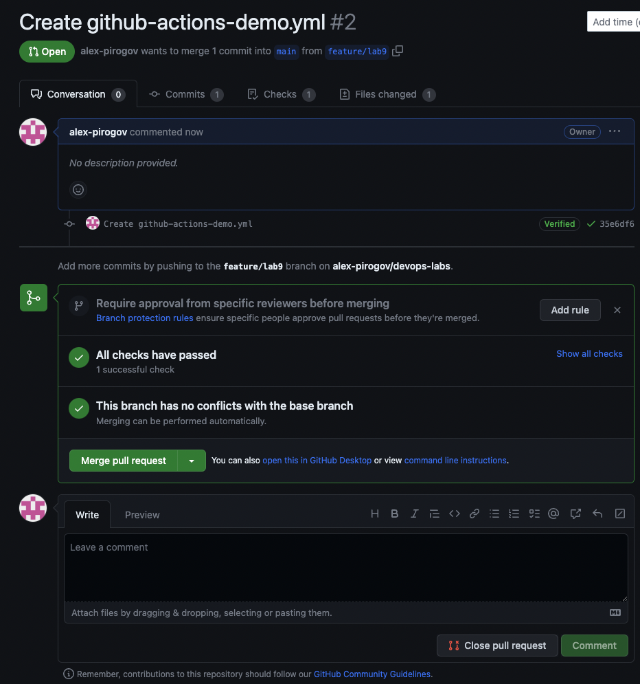
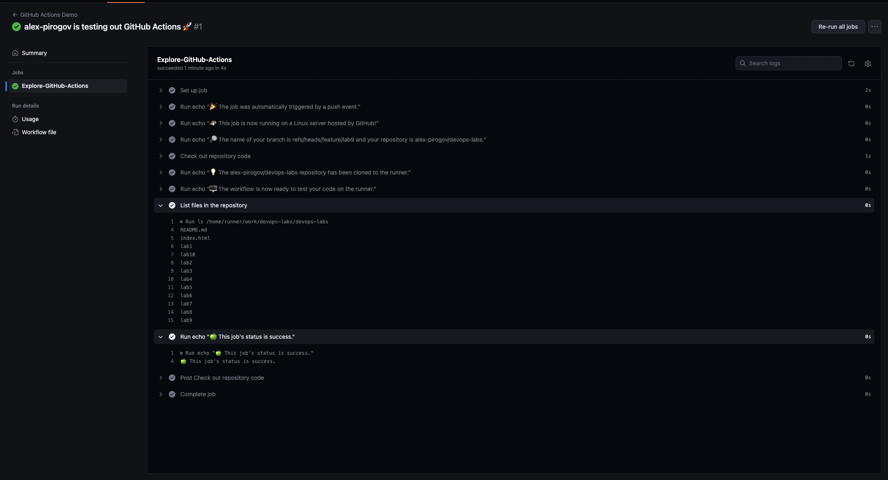
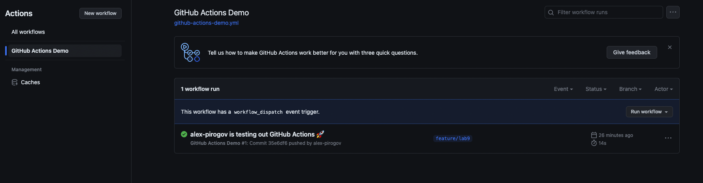

# CI/CD Lab - GitHub Actions

## Task 1: Create your First GitHub Actions Pipeline

1. Create a `.github/workflows` directory in your repository on GitHub if this directory does not already exist.
1. In the .github/workflows directory, create a file named `github-actions-demo.yml`
1. Copy the following YAML contents into the `github-actions-demo.yml` file

```
name: GitHub Actions Demo
run-name: ${{ github.actor }} is testing out GitHub Actions 🚀
on: [push]
jobs:
  Explore-GitHub-Actions:
    runs-on: ubuntu-latest
    steps:
      - run: echo "🎉 The job was automatically triggered by a ${{ github.event_name }} event."
      - run: echo "🐧 This job is now running on a ${{ runner.os }} server hosted by GitHub!"
      - run: echo "🔎 The name of your branch is ${{ github.ref }} and your repository is ${{ github.repository }}."
      - name: Check out repository code
        uses: actions/checkout@v3
      - run: echo "💡 The ${{ github.repository }} repository has been cloned to the runner."
      - run: echo "🖥️ The workflow is now ready to test your code on the runner."
      - name: List files in the repository
        run: |
          ls ${{ github.workspace }}
      - run: echo "🍏 This job's status is ${{ job.status }}."
```

4. Push this file triggering push actions at the same time:
    

    Check the result of actions after waiting for a while:
    

2. In the output of workflow execution we can see output of the commands which vere configured in `.github/workflows/github-actions-demo.yml`

## Task 2: Gathering System Information and Manual Triggering

1. Configure a Manual Trigger:
    Update workflow to be triggered manually, file `.github/workflows/github-actions-demo.yml`:
    ```
    - on: [push]
    + on: [workflow_dispatch]
    ```
    Now I can trigger workflow manuaaly using button:
    
2. Gather System Information:
    Modify workflow to include an additional step for gathering system information. Add code to `.github/workflows/github-actions-demo.yml`:
    ```
      - run: |
          echo "Operating System Info:"
          uname -a
          echo "CPU Info:"
          lscpu
          echo "Memory Info:"
          free -h
    ```
    System info in workflow output:
    