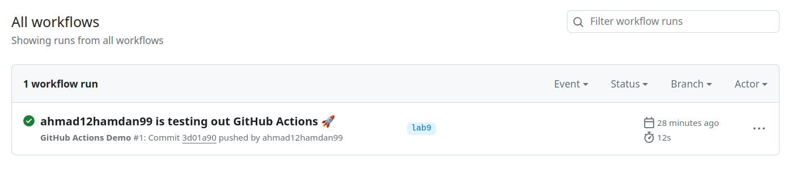
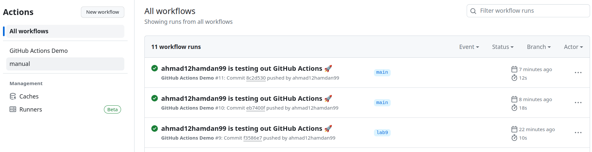
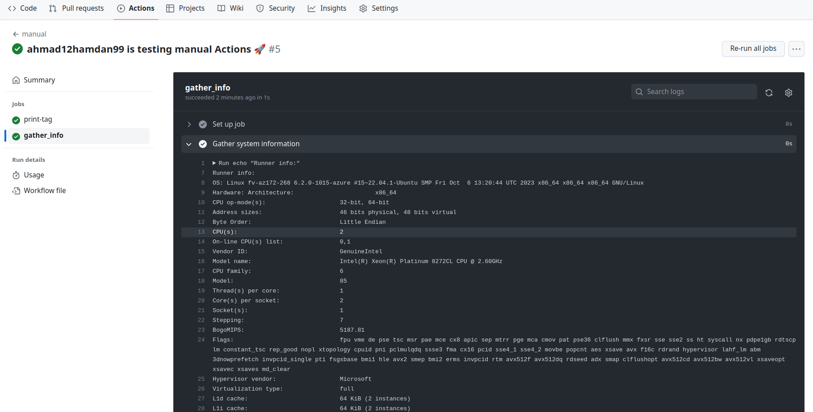

# Task1 - Create GitHub Actions Pipeline:
1. Created a `.github/workflows` directory in my repository
2. In the `.github/workflows` directory, created a file named `github-actions-demo.yml`
3. The content of `github-actions-demo.yml` is as follows: 
    ```yaml
    name: GitHub Actions Demo
    run-name: ${{ github.actor }} is testing out GitHub Actions 🚀
    on: [push]
    jobs:
    Explore-GitHub-Actions:
        runs-on: ubuntu-latest
        steps:
        - run: echo "🎉 The job was automatically triggered by a ${{ github.event_name }} event."
        - run: echo "🐧 This job is now running on a ${{ runner.os }} server hosted by GitHub!"
        - run: echo "🔎 The name of your branch is ${{ github.ref }} and your repository is ${{ github.repository }}."
        - name: Check out repository code
            uses: actions/checkout@v4
        - run: echo "💡 The ${{ github.repository }} repository has been cloned to the runner."
        - run: echo "🖥️ The workflow is now ready to test your code on the runner."
        - name: List files in the repository
            run: |
            ls ${{ github.workspace }}
        - run: echo "🍏 This job's status is ${{ job.status }}."

    ```
4. Committed the changes to the new branch `lab9`
        

# Task2 - Gathering System Information and Manual Triggering:
1. I added a new yaml file named `manual_action_test.yml` with the following content: 
    ```yaml
    name:  manual  
    run-name: ${{ github.actor }} is testing manual Actions 🚀
    on:
        workflow_dispatch:
        inputs:
            logLevel:
            description: 'Log level'
            required: true
            default: 'warning'
            type: choice
            options:
                - info
                - warning
                - debug
            print_tags:
            description: 'True to print to STDOUT'
            required: true
            type: boolean
            tags:
            description: 'Test scenario tags'
            required: true
            type: string
    jobs:
        print-tag:
            runs-on: ubuntu-latest
            if:  ${{ inputs.print_tags }} 
            steps:
                - name: Print the input tag to STDOUT
                run: echo  The tags are ${{ inputs.tags }} 
    ```
2. This gives the possibility to run the manual work flow
        
3. To gather system info I added the following jobs in `manual_action_test.yml`
    ```yaml
            gather_info:
                    runs-on: ubuntu-latest
                    steps:
                        - name: Gather system information
                        run: |
                                echo "Runner info:"
                                echo "OS: $(uname -a)"
                                echo "Hardware: $(lscpu)"
                                echo "Memory: $(free -h)"
    ```
     