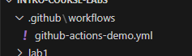
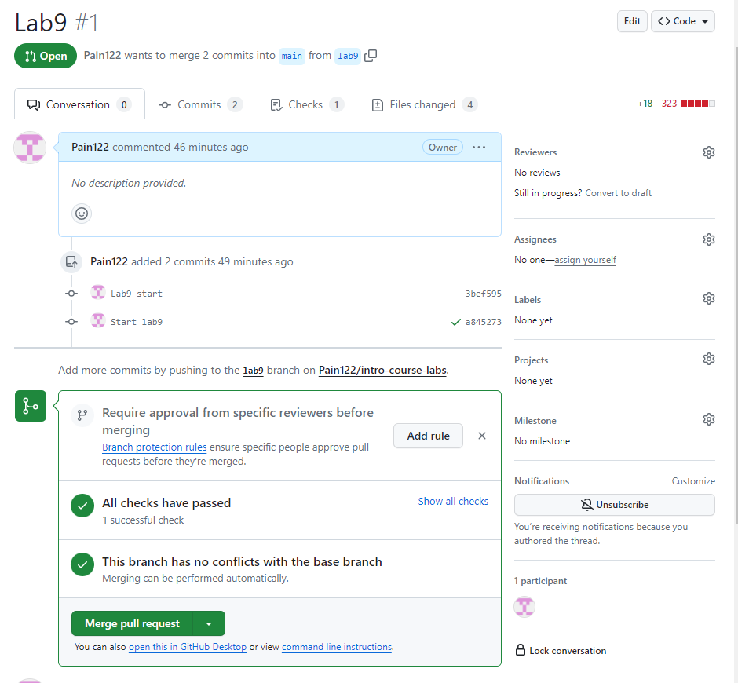
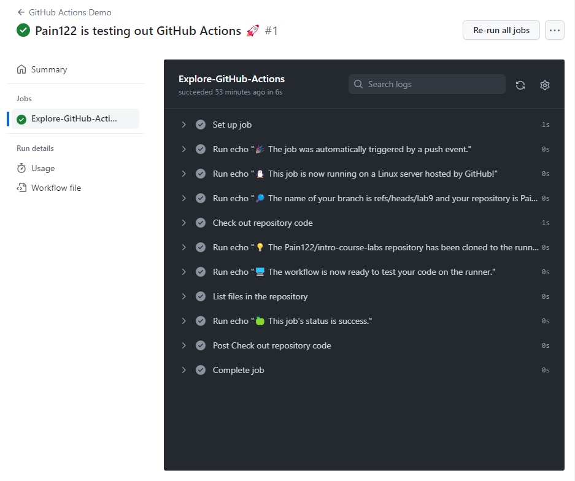
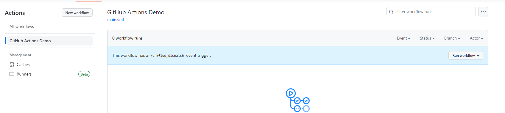
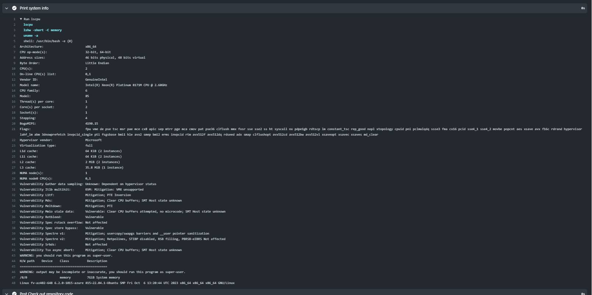

## Task 1

The first thing I did, I created a folder in the repository:



Then, I pushed chages to my repo into lab9 branch and created PR to my main. I could not obviously start pipelines from the upstream:



After that, I went to the actions page in my repo, and got to the explore page:



### Key concepts

1. GitHub Actions - GitHub solution for running pipelines
2. Workflow - configurable process to automate running jobs on your reposibory
3. Job - set of steps which are needed to be completed fully for a step to be considered completed
4. Step - a single atomic building block to build pipelines
5. Runner - a machine that is going to run steps and jobs of the pipeline
6. Artifact - some files that could be produced by pipelines for later use

## Workflow output

Pipeline I executed worked perfectly. The output is quite messy, so I stored it in different file. You can view it in result.txt


## Task 2.

### Add a manual start to actions

I needed only to change 
```yaml
on [push] 
```

to 

```yaml
on [workflow_dispatch]
```

After that I got what I needed



### Add new step

I only needed to add :

```sh
- name: Print system info
  run: |
    lscpu
    lshw -short -C memory
    uname -a
```

I got the output:



