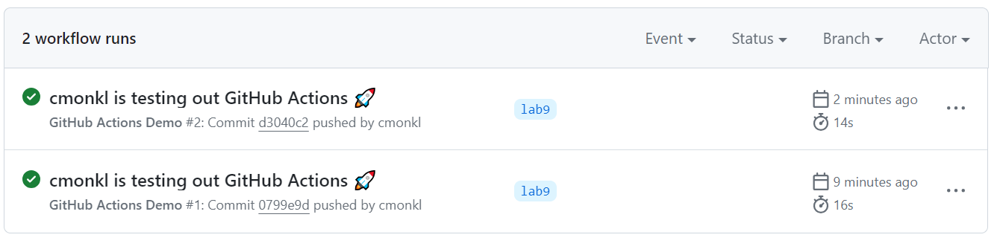
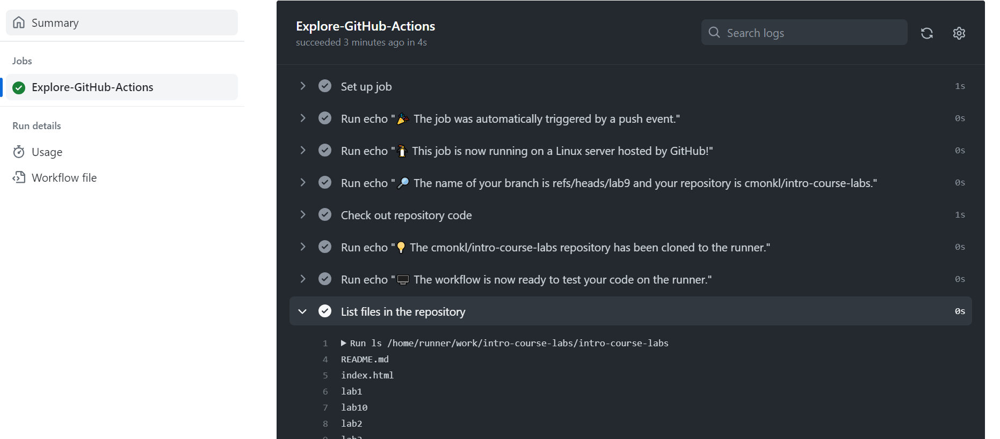
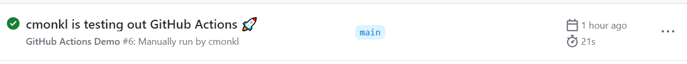
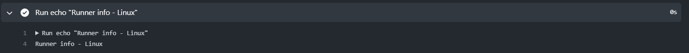
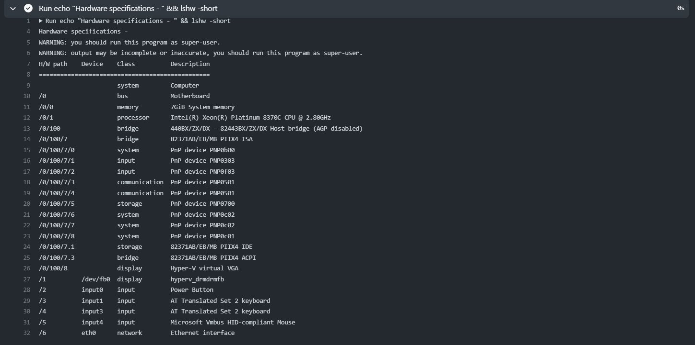
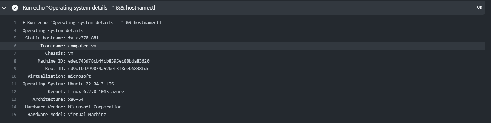

# Create GitHub Actions pipeline

Following the official guide to create GitHub Actions:
1. Create `.github/workflows` directory in the root of the repository.
2. Inside this directory create file `github-actions-demo.yml`.
3. Add the following configuration to the file:

        name: GitHub Actions Demo
        run-name: ${{ github.actor }} is testing out GitHub Actions 🚀
        on: [push]
        jobs:
        Explore-GitHub-Actions:
            runs-on: ubuntu-latest
            steps:
            - run: echo "🎉 The job was automatically triggered by a ${{ github.event_name }} event."
            - run: echo "🐧 This job is now running on a ${{ runner.os }} server hosted by GitHub!"
            - run: echo "🔎 The name of your branch is ${{ github.ref }} and your repository is ${{ github.repository }}."
            - name: Check out repository code
                uses: actions/checkout@v4
            - run: echo "💡 The ${{ github.repository }} repository has been cloned to the runner."
            - run: echo "🖥️ The workflow is now ready to test your code on the runner."
            - name: List files in the repository
                run: |
                ls ${{ github.workspace }}
            - run: echo "🍏 This job's status is ${{ job.status }}."
4. Commit and push the changes to repository

## Observations:
GitHub Actions allows to automate the workflows defined in .yml file in GitHub repository. Actions can be triggered by events such as code pushes, pull requests, etc.

## Workflow Execution:
The configuration defined in `github-actions-demo.yml` file triggers on push event and runs some prints. The result of the action run is presented in Actions tab in GitHub repository, each result is associated with push action. 

Clicking on the workflow run we can see the details of the workflow jobs and explore each step.

# Gathering System Information and Manual Triggering

## Configure a manual trigger:
To add a manual trigger append the workflow_dispatch option to the configuration file:

    on: [push, workflow_dispatch]

After updating action configuration and merging changes to `main` branch there is a button to run workflow manually.

## Gather system information
Add new job to existing workflow to print system information and push changes to repository:

    Gather-System-Info:
    runs-on: ubuntu-latest
    steps:
      - run: echo "Runner info - ${{ runner.os }}"
      - run: echo "Hardware specifications - " && lshw -short
      - run: echo "Operating system details - " && hostnamectl

Output:

