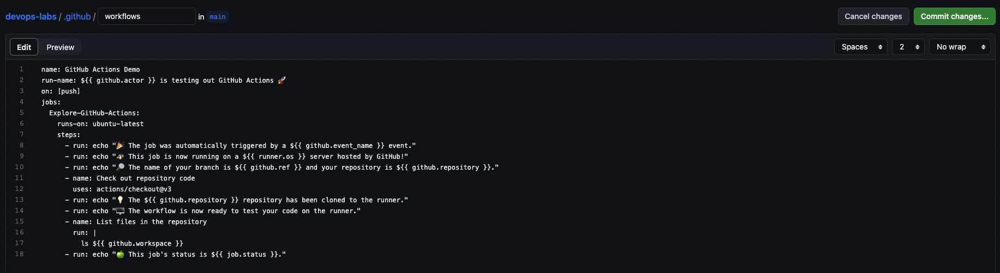

# CI/CD Lab - GitHub Actions

## Task 1: Create your First GitHub Actions Pipeline

1. Read the Official Guide:
    Create Github actions configuration file:
    

    Push this file triggering push actions at the same time:
    

    Check the result of actions after waiting for a while:
    

2. In the output of workflow execution we can see output of the commands which vere configured in `.github/workflows/github-actions-demo.yml`

## Task 2: Gathering System Information and Manual Triggering

1. Configure a Manual Trigger:
    Update workflow to be triggered manually, file `.github/workflows/github-actions-demo.yml`:
    ```
    - on: [push]
    + on: [workflow_dispatch]
    ```

    Now I can trigger workflow manuaaly using button:
    

2. Gather System Information:
    Modify workflow to include an additional step for gathering system information. Add code to `.github/workflows/github-actions-demo.yml`:
    ```
      - run: |
          echo "Operating System Info:"
          uname -a

          echo "CPU Info:"
          lscpu

          echo "Memory Info:"
          free -h
    ```

    System info in workflow output:
    
