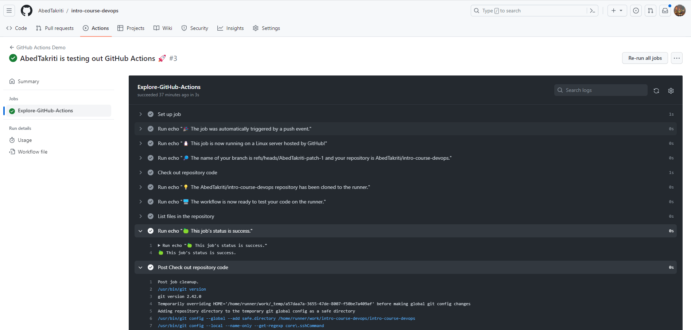
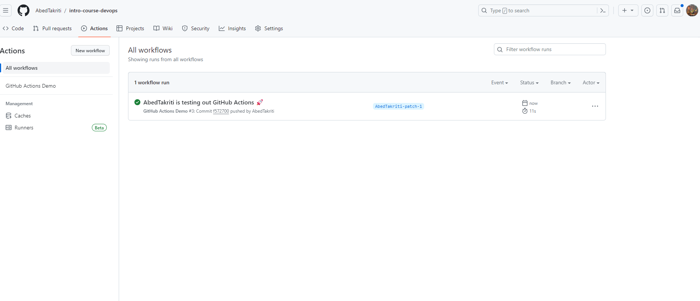
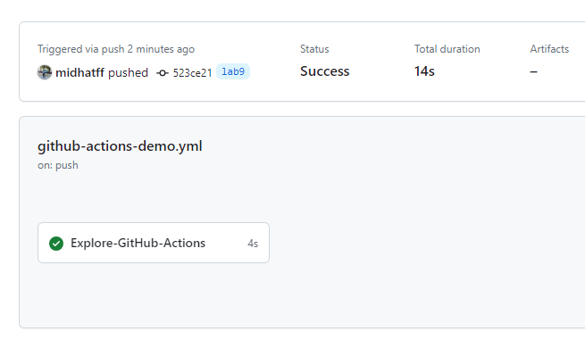
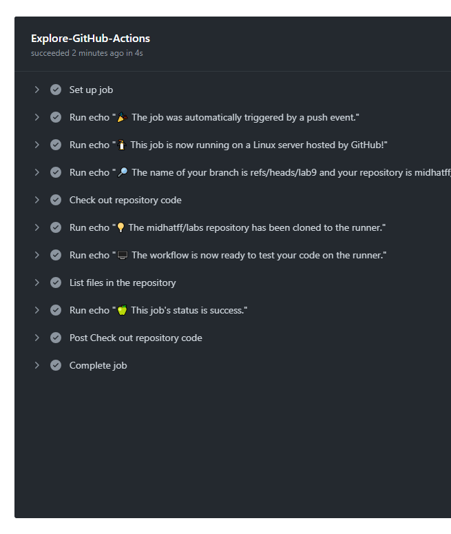

# CI/CD Lab - GitHub Actions

## Task 1: Create your First GitHub Actions Pipeline

1. Create a `.github/workflows` directory in your repository on GitHub if this directory does not already exist.
1. In the .github/workflows directory, create a file named `github-actions-demo.yml`
1. Copy the following YAML contents into the `github-actions-demo.yml` file

```
name: GitHub Actions Demo
run-name: ${{ github.actor }} is testing out GitHub Actions 🚀
on: [push]
jobs:
  Explore-GitHub-Actions:
    runs-on: ubuntu-latest
    steps:
      - run: echo "🎉 The job was automatically triggered by a ${{ github.event_name }} event."
      - run: echo "🐧 This job is now running on a ${{ runner.os }} server hosted by GitHub!"
      - run: echo "🔎 The name of your branch is ${{ github.ref }} and your repository is ${{ github.repository }}."
      - name: Check out repository code
        uses: actions/checkout@v3
      - run: echo "💡 The ${{ github.repository }} repository has been cloned to the runner."
      - run: echo "🖥️ The workflow is now ready to test your code on the runner."
      - name: List files in the repository
        run: |
          ls ${{ github.workspace }}
      - run: echo "🍏 This job's status is ${{ job.status }}."
```
1. Commit already have workflow so it start to run






1. It is good to see the variables wich I will use in real cases

## Task 2: Gathering System Information and Manual Triggering

1. Configure a Manual Trigger:
    Update workflow to be triggered manually, file `.github/workflows/github-actions-demo.yml`:
    ```
    - on: [push]
    + on: [workflow_dispatch]
    ```
    Now I can trigger workflow manualy using button:
2. Gather System Information:
    Modify workflow to include an additional step for gathering system information. Add code to `.github/workflows/github-actions-demo.yml`:
    ```
        - name: System Information
        run: 
            lscpu &&
            free -h &&
            df -h
        - name: OS Information
        run:
            lsb_release -a
    ```
    System info in workflow output:
    ```
        Run lscpu && free -h && df -h
    Architecture:                    x86_64
    CPU op-mode(s):                  32-bit, 64-bit
    Address sizes:                   46 bits physical, 48 bits virtual
    Byte Order:                      Little Endian
    CPU(s):                          2
    On-line CPU(s) list:             0,1
    Vendor ID:                       GenuineIntel
    ```    
    OS Information:
    ```
    Run lsb_release -a
    No LSB modules are available.
    Distributor ID:	Ubuntu
    Description:	Ubuntu 22.04.2 LTS
    Release:	22.04
    Codename:	jammy
    ```