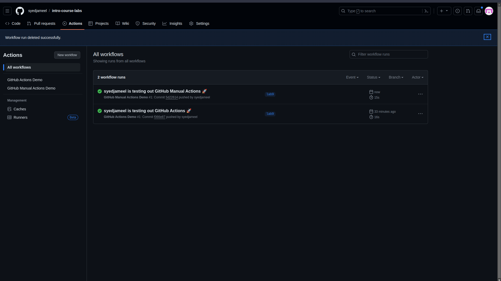
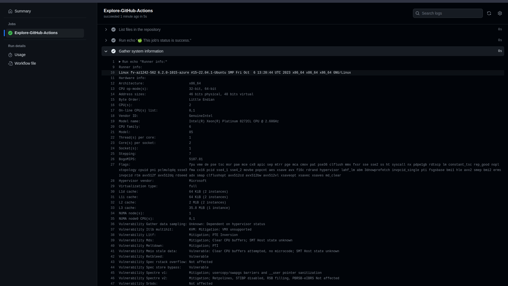

## Task 1: Create your First GitHub Actions Pipeline

Steps to create a basic workflow from github actions quick start guide
- Create a ```.github/workflows``` folder in the root folder of the repo.
- then create a yaml file ```github-actions-demo.yml``` in that folder.
- paste the following demo in that .yml file,
```yml
    name: GitHub Actions Demo
    run-name: ${{ github.actor }} is testing out GitHub Actions 🚀
    on: [push]
    jobs:
    Explore-GitHub-Actions:
        runs-on: ubuntu-latest
        steps:
        - run: echo "🎉 The job was automatically triggered by a ${{ github.event_name }} event."
        - run: echo "🐧 This job is now running on a ${{ runner.os }} server hosted by GitHub!"
        - run: echo "🔎 The name of your branch is ${{ github.ref }} and your repository is ${{ github.repository }}."
        - name: Check out repository code
            uses: actions/checkout@v4
        - run: echo "💡 The ${{ github.repository }} repository has been cloned to the runner."
        - run: echo "🖥️ The workflow is now ready to test your code on the runner."
        - name: List files in the repository
            run: |
            ls ${{ github.workspace }}
        - run: echo "🍏 This job's status is ${{ job.status }}."
```

- Now you will see that the workflow is triggered as soon as we push it to our repo

- 

``` -------------------------------- End of Task 1 --------------------------------``` 

## Task 2: Gathering System Information and Manual Triggering

Steps to create a basic workflow for ```manual triggering``` and to ```gather system info```

1. **Manual triggering**

- create a new yaml file in the ```.github/workflows``` folder called ```github-manual-actions.yml```
- now paste the following stuff in that file
```yml
name: GitHub Manual Actions Demo
run-name: ${{ github.actor }} is testing out GitHub Manual Actions 🚀
on: 
    push:
    workflow_dispatch:
jobs:
  Explore-GitHub-Actions:
    runs-on: ubuntu-latest
    steps:
      - run: echo "🎉 The job was manualy triggered by a ${{ github.event_name }} event."
      - run: echo "🐧 This job is now running on a ${{ runner.os }} server hosted by GitHub!"
      - run: echo "🔎 The name of your branch is ${{ github.ref }} and your repository is ${{ github.repository }}."
      - name: Check out repository code
        uses: actions/checkout@v4
      - run: echo "💡 The ${{ github.repository }} repository has been cloned to the runner."
      - run: echo "🖥️ The workflow is now ready to test your code on the runner."
      - name: List files in the repository
        run: |
          ls ${{ github.workspace }}
      - run: echo "🍏 This job's status is ${{ job.status }}."
```

2. **Gather system info**

- finally just add the following few lines in the ```github-manual-actions.yml``` as follows to gather system info
```yml
      - name: Gather system information
        run: |
          echo "Runner info:"
          uname -a
          echo "Hardware info:"
          lscpu
          echo "Operating system details:"
          cat /etc/os-release
```

The system information is as follows:

```shell
0s
Run echo "Runner info:"

Runner info:
Linux fv-az1242-562 6.2.0-1015-azure #15~22.04.1-Ubuntu SMP Fri Oct  6 13:20:44 UTC 2023 x86_64 x86_64 x86_64 GNU/Linux

Hardware info:
Architecture:                       x86_64
CPU op-mode(s):                     32-bit, 64-bit
Address sizes:                      46 bits physical, 48 bits virtual
Byte Order:                         Little Endian
CPU(s):                             2
On-line CPU(s) list:                0,1
Vendor ID:                          GenuineIntel
Model name:                         Intel(R) Xeon(R) Platinum 8272CL CPU @ 2.60GHz
CPU family:                         6
Model:                              85
Thread(s) per core:                 1
Core(s) per socket:                 2
Socket(s):                          1
Stepping:                           7
BogoMIPS:                           5187.81
Flags:                              fpu vme de pse tsc msr pae mce cx8 apic sep mtrr pge mca cmov pat pse36 clflush mmx fxsr sse sse2 ss ht syscall nx pdpe1gb rdtscp lm constant_tsc rep_good nopl xtopology cpuid pni pclmulqdq ssse3 fma cx16 pcid sse4_1 sse4_2 movbe popcnt aes xsave avx f16c rdrand hypervisor lahf_lm abm 3dnowprefetch invpcid_single pti fsgsbase bmi1 hle avx2 smep bmi2 erms invpcid rtm avx512f avx512dq rdseed adx smap clflushopt avx512cd avx512bw avx512vl xsaveopt xsavec xsaves md_clear
Hypervisor vendor:                  Microsoft
Virtualization type:                full
L1d cache:                          64 KiB (2 instances)
L1i cache:                          64 KiB (2 instances)
L2 cache:                           2 MiB (2 instances)
L3 cache:                           35.8 MiB (1 instance)
NUMA node(s):                       1
NUMA node0 CPU(s):                  0,1
Vulnerability Gather data sampling: Unknown: Dependent on hypervisor status
Vulnerability Itlb multihit:        KVM: Mitigation: VMX unsupported
Vulnerability L1tf:                 Mitigation; PTE Inversion
Vulnerability Mds:                  Mitigation; Clear CPU buffers; SMT Host state unknown
Vulnerability Meltdown:             Mitigation; PTI
Vulnerability Mmio stale data:      Vulnerable: Clear CPU buffers attempted, no microcode; SMT Host state unknown
Vulnerability Retbleed:             Vulnerable
Vulnerability Spec rstack overflow: Not affected
Vulnerability Spec store bypass:    Vulnerable
Vulnerability Spectre v1:           Mitigation; usercopy/swapgs barriers and __user pointer sanitization
Vulnerability Spectre v2:           Mitigation; Retpolines, STIBP disabled, RSB filling, PBRSB-eIBRS Not affected
Vulnerability Srbds:                Not affected
Vulnerability Tsx async abort:      Mitigation; Clear CPU buffers; SMT Host state unknown

Operating system details:
PRETTY_NAME="Ubuntu 22.04.3 LTS"
NAME="Ubuntu"
VERSION_ID="22.04"
VERSION="22.04.3 LTS (Jammy Jellyfish)"
VERSION_CODENAME=jammy
ID=ubuntu
ID_LIKE=debian
HOME_URL="https://www.ubuntu.com/"
SUPPORT_URL="https://help.ubuntu.com/"
BUG_REPORT_URL="https://bugs.launchpad.net/ubuntu/"
PRIVACY_POLICY_URL="https://www.ubuntu.com/legal/terms-and-policies/privacy-policy"
UBUNTU_CODENAME=jammy
```




``` -------------------------------- End of Task 2 --------------------------------``` 

