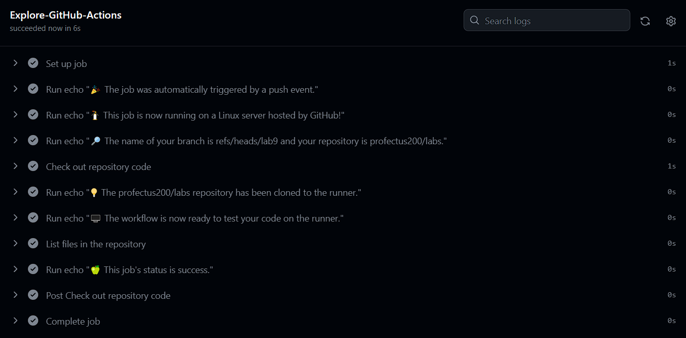

## GitHub Actions
### Steps To Create Simple Workflow
1. Create a `.github/workflows` directory in your repository on GitHub if this directory does not already exist.
2. In the `.github/workflows` directory, create a file named `github-actions-demo.yml`.
3. Copy the following YAML contents into the `github-actions-demo.yml` file:
```yaml
name: GitHub Actions Demo
run-name: ${{ github.actor }} is testing out GitHub Actions 🚀
on: [push]
jobs:
  Explore-GitHub-Actions:
    runs-on: ubuntu-latest
    steps:
      - run: echo "🎉 The job was automatically triggered by a ${{ github.event_name }} event."
      - run: echo "🐧 This job is now running on a ${{ runner.os }} server hosted by GitHub!"
      - run: echo "🔎 The name of your branch is ${{ github.ref }} and your repository is ${{ github.repository }}."
      - name: Check out repository code
        uses: actions/checkout@v3
      - run: echo "💡 The ${{ github.repository }} repository has been cloned to the runner."
      - run: echo "🖥️ The workflow is now ready to test your code on the runner."
      - name: List files in the repository
        run: |
          ls ${{ github.workspace }}
      - run: echo "🍏 This job's status is ${{ job.status }}."
```

Committing the workflow file to a branch in your repository triggers the push event and runs your workflow.

## Output Of My Workflow


## Manual Trigger
To add a manual trigger we have to change `on:` part of our `github-actions-demo.yml` file to look as follows:  
```yaml
on:
  push:
  workflow_dispatch:
```

## Gathering System Information
To gather system information we need our `github-actions-demo.yml` file to look as follows:
```yaml
name: GitHub Actions Demo
on:
  push:
  workflow_dispatch:

jobs:
  Explore-GitHub-Actions:
    runs-on: ubuntu-latest
    steps:
      - run: echo "🎉 The job was automatically triggered by a ${{ github.event_name }} event."
      - run: echo "🐧 This job is now running on a ${{ runner.os }} server hosted by GitHub!"
      - run: echo "🔎 The name of your branch is ${{ github.ref }} and your repository is ${{ github.repository }}."
      - name: Check out repository code
        uses: actions/checkout@v3
      - run: echo "💡 The ${{ github.repository }} repository has been cloned to the runner."
      - run: echo "🖥️ The workflow is now ready to test your code on the runner."
      - name: List files in the repository
        run: |
          ls ${{ github.workspace }}
      - run: echo "🍏 This job's status is ${{ job.status }}."

      # New step: Gather system information
      - name: Gather System Information
        uses: actions/setup-node@v2
        with:
          node-version: '14'
      - run: |
          echo "🖥️ Runner Labels: ${{ runner.labels }}"
          echo "🔩 CPU Cores: $(nproc)"
          echo "🧠 Memory: $(free -h | awk '/^Mem/ {print $2}')"
          echo "🐧 Operating System: $(lsb_release -a 2>/dev/null | grep 'Description' | cut -f2-)"
        shell: bash
```