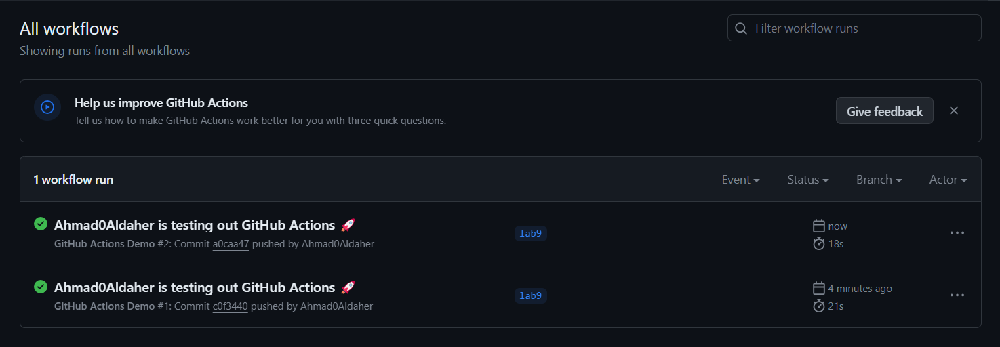
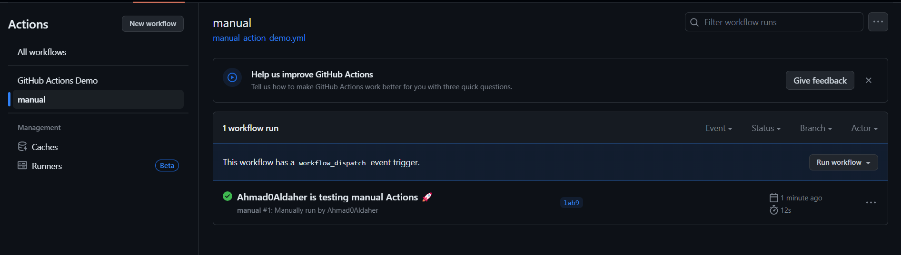
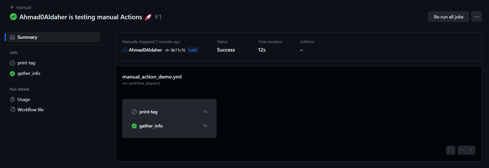
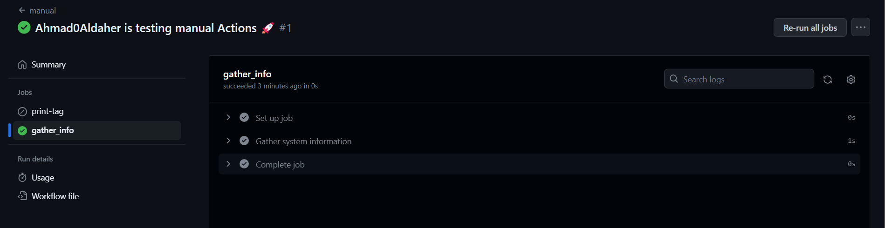
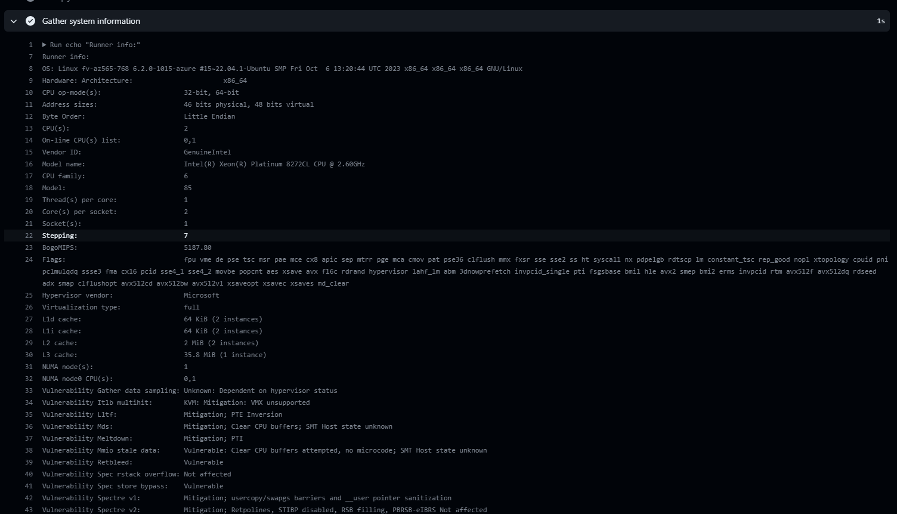

# CI/CD Lab - GitHub Actions


## Task 1: Create GitHub Actions Pipeline

Following the official GitHub Actions quickstart guide.

1. Created a .github/workflows directory in this used repo

2. In the .github/workflows directory, create a file named `github-actions-demo.yml`.

3. Then Copied the following YAML from the quickstart guide  into the `github-actions-demo.yml` file:
     ```yaml
    name: GitHub Actions Demo
    run-name: ${{ github.actor }} is testing out GitHub Actions 🚀
    on: [push]
    jobs:
    Explore-GitHub-Actions:
        runs-on: ubuntu-latest
        steps:
        - run: echo "🎉 The job was automatically triggered by a ${{ github.event_name }} event."
        - run: echo "🐧 This job is now running on a ${{ runner.os }} server hosted by GitHub!"
        - run: echo "🔎 The name of your branch is ${{ github.ref }} and your repository is ${{ github.repository }}."
        - name: Check out repository code
            uses: actions/checkout@v4
        - run: echo "💡 The ${{ github.repository }} repository has been cloned to the runner."
        - run: echo "🖥️ The workflow is now ready to test your code on the runner."
        - name: List files in the repository
            run: |
            ls ${{ github.workspace }}
        - run: echo "🍏 This job's status is ${{ job.status }}."
    ```

4. Staged the files  ` git add .` commited, ` git commit -m "workflow" ` , then pushed `git push --set-upstream origin lab9`

5. Then action became available in action tab in the repo in the actions tab in the github.

6. Finally did some changes and push them , the workflow run automatically without any errors:

     


 ## Task 2: Gathering System Information and Manual Triggering

 1. Configure a Manual Trigger:
    - Added the following YAML file  `manual_action_demo.yml`
        with the following content  to the workflow directory:
        ```yaml
        name:  manual  
        run-name: ${{ github.actor }} is testing manual Actions 🚀
        on:
            workflow_dispatch:
            inputs:
                logLevel:
                description: 'Log level'
                required: true
                default: 'warning'
                type: choice
                options:
                    - info
                    - warning
                    - debug
                print_tags:
                description: 'True to print to STDOUT'
                required: true
                type: boolean
                tags:
                description: 'Test scenario tags'
                required: true
                type: string
        jobs:
            print-tag:
                runs-on: ubuntu-latest
                if:  ${{ inputs.print_tags }} 
                steps:
                    - name: Print the input tag to STDOUT
                    run: echo  The tags are ${{ inputs.tags }} 
        ```
    - Now from the action tab it's possible to run the manual work flow
    
        

2. Gather System Information:
    - Modify the workflow by  including an additional step for gathering system information. add the following lines to the jobs in the 
    `manual_action_demo.yml` file:
        ```yaml
        gather_info:
            runs-on: ubuntu-latest
            steps:
                - name: Gather system information
                run: |
                        echo "OS info:"
                        echo "OS: $(uname -a)"
                        echo "CPU Info: $(lscpu)"
                        echo "RAM Info: $(free -m)"
        ```
    
    
    - And the results for system information are:
    