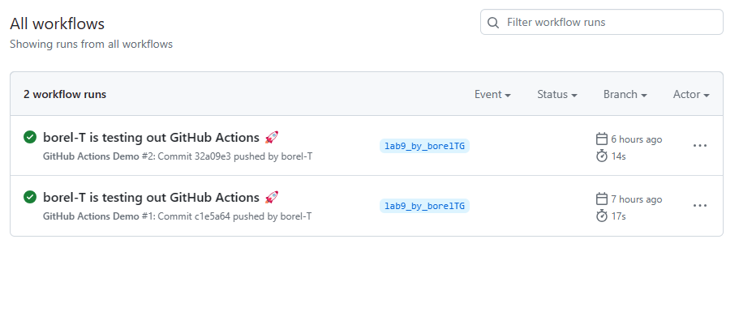
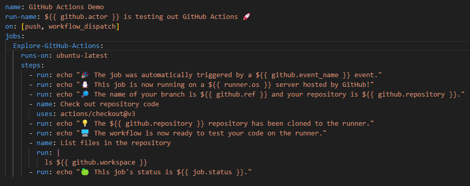
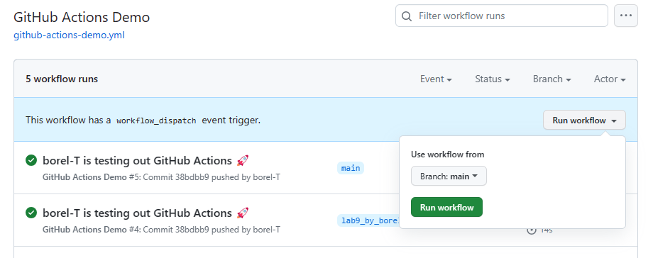
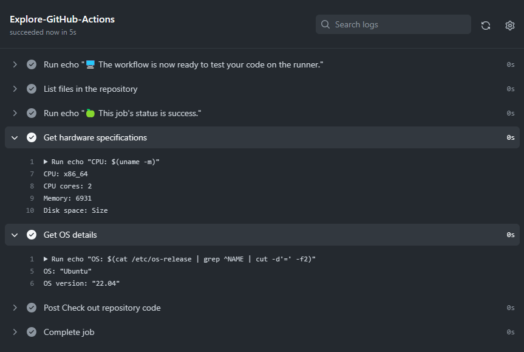

# Github Actions

```
DevOps Toolchain Category: Version control, CI-CD
```

## Create your First GitHub Actions Pipeline:

Observations: Actually it is quite simple. The steps to setup this pipeline are :

- I crreated a '.github/workflow' directory in from the project source
- Inside this directory I created a 'github-actions.yml'
- I copy and pasted the actions to run in the 'github-actions.yml' file
- I Committed the changes on the branch

Observations:

- Each time I push a commit on the branch having the workflow-actions, the actions specified in the YAML file runs.

**Image view**


## Gathering System Information and Manual Triggering :

### Configure a Manual Trigger:

The steps I followed to add a manual trigger to my workflow

- I edited my workflow file to add a new trigger ('workflow_dispactch' event ).

**Image view**


- I added this event under the "On" key section
- I saved the changes and committed them

Obersations : On the GitHub repository, in the workflow list, I could see a "Run Workflow" button added to my edited workflow

- To run it, I then clicked, on the "Run workflow" and leaving the inputs parameters empty.

**Image view**


Observations: For the workflow dispatch, to be detected, I had to merge my branch to the main branch, as per github actions documentation.

### Gather System Information:

#### System information gathering

To gather system information, These are the steps I followed :

- I modified my workflow to add 2 actions "Get hardware specifications" and "Get hardware specifications"
- In both action I used system command to print out the required information

#### Get Hardware specifications

```sh
- name: Get hardware specifications
    run: |
        echo "CPU: $(uname -m)"
        echo "CPU cores: $(nproc)"
        echo "Memory: $(free -m | awk '/^Mem:/ {print $2}')"
        echo "Disk space: $(df -h | awk '/^Filesystem/ {print $2}')"
```

#### Get OS details

```sh
- name: Get OS details
    run: |
        echo "OS: $(cat /etc/os-release | grep ^NAME | cut -d'=' -f2)"
        echo "OS version: $(cat /etc/os-release | grep ^VERSION_ID | cut -d'=' -f2)"
```

**Image view**

