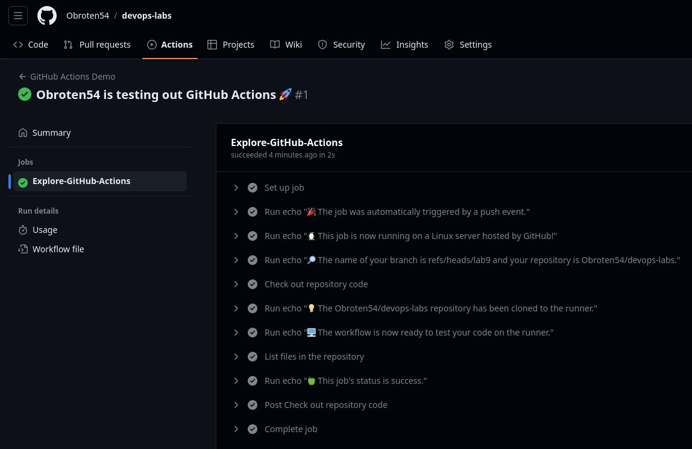
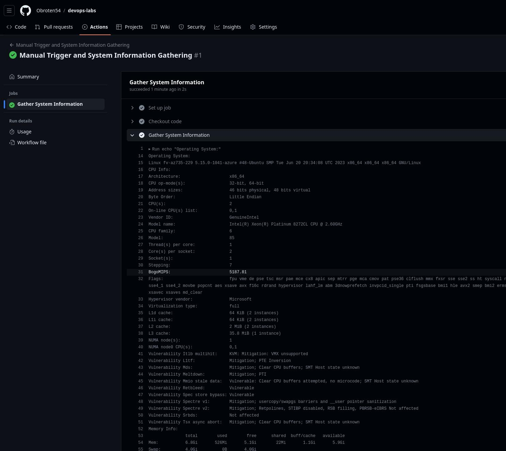

# CI/CD - GitHub Actions

## Creating a GitHub Actions Pipeline

1. Make a new folder named ".github/workflows" in your repository and generate a file called "github-actions-demo.yml" within this folder.
2. Insert the provided code into the "github-actions-demo.yml" file, which can be found at ".github/workflows/github-actions-demo.yml".
3. Save your changes and push them to the repository.
4. Go to the Actions tab to watch the workflow execution.

Results:



## Gathering System Information and Manual Triggering

1. Create a new file and add code, as seen in .github/workflows/github-actions-manual-trigger.yml
2. Push the changes.
3. Marge to main
4. Click on the "Actions" tab at the top of the repository.
5. In the left sidebar, you will see a list of workflows available in your repository. Find the workflow you want to run. In this case, it would be the workflow you created and named in the YAML file, e.g., "Manual Trigger and System Information Gathering."
6. Click on the workflow name to open the workflow details page.
7. On the top right of the workflow details page, you should see a "Run workflow" button. Click on it.

Results:


Output:
```bash
Operating System:
Linux fv-az735-229 5.15.0-1041-azure #48-Ubuntu SMP Tue Jun 20 20:34:08 UTC 2023 x86_64 x86_64 x86_64 GNU/Linux
CPU Info:
Architecture:                    x86_64
CPU op-mode(s):                  32-bit, 64-bit
Address sizes:                   46 bits physical, 48 bits virtual
Byte Order:                      Little Endian
CPU(s):                          2
On-line CPU(s) list:             0,1
Vendor ID:                       GenuineIntel
Model name:                      Intel(R) Xeon(R) Platinum 8272CL CPU @ 2.60GHz
CPU family:                      6
Model:                           85
Thread(s) per core:              1
Core(s) per socket:              2
Socket(s):                       1
Stepping:                        7
BogoMIPS:                        5187.81
Flags:                           fpu vme de pse tsc msr pae mce cx8 apic sep mtrr pge mca cmov pat pse36 clflush mmx fxsr sse sse2 ss ht syscall nx pdpe1gb rdtscp lm constant_tsc rep_good nopl xtopology cpuid pni pclmulqdq ssse3 fma cx16 pcid sse4_1 sse4_2 movbe popcnt aes xsave avx f16c rdrand hypervisor lahf_lm abm 3dnowprefetch invpcid_single pti fsgsbase bmi1 hle avx2 smep bmi2 erms invpcid rtm avx512f avx512dq rdseed adx smap clflushopt avx512cd avx512bw avx512vl xsaveopt xsavec xsaves md_clear
Hypervisor vendor:               Microsoft
Virtualization type:             full
L1d cache:                       64 KiB (2 instances)
L1i cache:                       64 KiB (2 instances)
L2 cache:                        2 MiB (2 instances)
L3 cache:                        35.8 MiB (1 instance)
NUMA node(s):                    1
NUMA node0 CPU(s):               0,1
Vulnerability Itlb multihit:     KVM: Mitigation: VMX unsupported
Vulnerability L1tf:              Mitigation; PTE Inversion
Vulnerability Mds:               Mitigation; Clear CPU buffers; SMT Host state unknown
Vulnerability Meltdown:          Mitigation; PTI
Vulnerability Mmio stale data:   Vulnerable: Clear CPU buffers attempted, no microcode; SMT Host state unknown
Vulnerability Retbleed:          Vulnerable
Vulnerability Spec store bypass: Vulnerable
Vulnerability Spectre v1:        Mitigation; usercopy/swapgs barriers and __user pointer sanitization
Vulnerability Spectre v2:        Mitigation; Retpolines, STIBP disabled, RSB filling, PBRSB-eIBRS Not affected
Vulnerability Srbds:             Not affected
Vulnerability Tsx async abort:   Mitigation; Clear CPU buffers; SMT Host state unknown
Memory Info:
total        used        free      shared  buff/cache   available
Mem:           6.8Gi       526Mi       5.1Gi        22Mi       1.1Gi       5.9Gi
Swap:          4.0Gi          0B       4.0Gi
Disk Space:
Filesystem      Size  Used Avail Use% Mounted on
/dev/root        84G   61G   23G  73% /
tmpfs           3.4G  172K  3.4G   1% /dev/shm
tmpfs           1.4G  1.1M  1.4G   1% /run
tmpfs           5.0M     0  5.0M   0% /run/lock
/dev/sda15      105M  6.1M   99M   6% /boot/efi
/dev/sdb1        14G  4.1G  9.0G  31% /mnt
tmpfs           694M   12K  694M   1% /run/user/1001
```