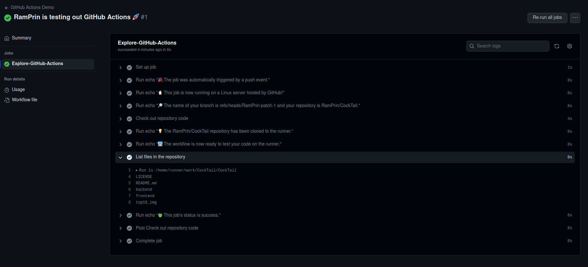

# Introduction to DevOps Lab9
**Leonid Zelenskiy** <br>
**B21-CS-01** <br>
*l.zelenskiy@innopolis.university*

## GitHub Actions Quickstart


## Gathering System Information and Manual Triggering
To enable manual trigger use `on: workflow_dispatch`

`**main.yml**`:
```
name: Gihub Manual Trigger
run-name: Manual Trigger IDV
on: workflow_dispatch
jobs: 
  Exploring:
    runs-on: ubuntu-latest
    steps:
    - run: lshw
    - run: uname -a
```
**Result**:
``` bash
Run lshw
WARNING: you should run this program as super-user.
fv-az587-343
    description: Computer
    width: 64 bits
    capabilities: smp vsyscall32
WARNING: output may be incomplete or inaccurate, you should run this program as super-user.
  *-core
       description: Motherboard
       physical id: 0
     *-memory
          description: System memory
          physical id: 0
          size: 7GiB
     *-cpu
          product: Intel(R) Xeon(R) Platinum 8370C CPU @ 2.80GHz
          vendor: Intel Corp.
          physical id: 1
          bus info: cpu@0
          version: 6.106.6
          width: 64 bits
          capabilities: fpu fpu_exception wp vme de pse tsc msr pae mce cx8 apic sep mtrr pge mca cmov pat pse36 clflush mmx fxsr sse sse2 ss ht syscall nx pdpe1gb rdtscp x86-64 constant_tsc rep_good nopl xtopology cpuid pni pclmulqdq ssse3 fma cx16 pcid sse4_1 sse4_2 movbe popcnt aes xsave avx f16c rdrand hypervisor lahf_lm abm 3dnowprefetch invpcid_single pti fsgsbase bmi1 hle avx2 smep bmi2 erms invpcid rtm avx512f avx512dq rdseed adx smap clflushopt avx512cd avx512bw avx512vl xsaveopt xsavec xsaves md_clear
          configuration: microcode=4294967295
     *-pci
          description: Host bridge
          product: 440BX/ZX/DX - 82443BX/ZX/DX Host bridge (AGP disabled)
          vendor: Intel Corporation
          physical id: 100
          bus info: pci@0000:00:00.0
          version: 03
          width: 32 bits
          clock: 33MHz
        *-isa
             description: ISA bridge
             product: 82371AB/EB/MB PIIX4 ISA
             vendor: Intel Corporation
             physical id: 7
             bus info: pci@0000:00:07.0
             version: 01
             width: 32 bits
             clock: 33MHz
             capabilities: isa bus_master
             configuration: latency=0
           *-pnp00:00
                product: PnP device PNP0b00
                physical id: 0
                capabilities: pnp
                configuration: driver=rtc_cmos
           *-pnp00:01
                product: PnP device PNP0303
                physical id: 1
                capabilities: pnp
                configuration: driver=i8042 kbd
           *-pnp00:02
                product: PnP device PNP0f03
                physical id: 2
                capabilities: pnp
                configuration: driver=i8042 aux
           *-pnp00:03
                product: PnP device PNP0501
                physical id: 3
                capabilities: pnp
                configuration: driver=serial
           *-pnp00:04
                product: PnP device PNP0501
                physical id: 4
                capabilities: pnp
                configuration: driver=serial
           *-pnp00:05
                product: PnP device PNP0700
                physical id: 5
                capabilities: pnp
           *-pnp00:06
                product: PnP device PNP0c02
                physical id: 6
                capabilities: pnp
                configuration: driver=system
           *-pnp00:07
                product: PnP device PNP0c02
                physical id: 7
                capabilities: pnp
                configuration: driver=system
           *-pnp00:08
                product: PnP device PNP0c01
                physical id: 8
                capabilities: pnp
                configuration: driver=system
        *-ide
             description: IDE interface
             product: 82371AB/EB/MB PIIX4 IDE
             vendor: Intel Corporation
             physical id: 7.1
             bus info: pci@0000:00:07.1
             version: 01
             width: 32 bits
             clock: 33MHz
             capabilities: ide isa_compat_mode bus_master
             configuration: driver=ata_piix latency=0
             resources: irq:0 ioport:1f0(size=8) ioport:3f6 ioport:170(size=8) ioport:376 ioport:ffa0(size=16)
        *-bridge UNCLAIMED
             description: Bridge
             product: 82371AB/EB/MB PIIX4 ACPI
             vendor: Intel Corporation
             physical id: 7.3
             bus info: pci@0000:00:07.3
             version: 02
             width: 32 bits
             clock: 33MHz
             capabilities: bridge
             configuration: latency=0
        *-display
             description: VGA compatible controller
             product: Hyper-V virtual VGA
             vendor: Microsoft Corporation
             physical id: 8
             bus info: pci@0000:00:08.0
             version: 00
             width: 32 bits
             clock: 33MHz
             capabilities: vga_controller bus_master rom
             configuration: driver=hyperv_drm latency=0
             resources: irq:11 memory:f8000000-fbffffff memory:c0000-dffff
  *-graphics
       product: hyperv_drmdrmfb
       physical id: 1
       logical name: /dev/fb0
       capabilities: fb
       configuration: depth=32 resolution=1024,768
  *-input:0
       product: Power Button
       physical id: 2
       logical name: input0
       logical name: /dev/input/event0
       capabilities: platform
  *-input:1
       product: AT Translated Set 2 keyboard
       physical id: 3
       logical name: input1
       logical name: /dev/input/event1
       capabilities: i8042
  *-input:2
       product: AT Translated Set 2 keyboard
       physical id: 4
       logical name: input3
       logical name: /dev/input/event2
       capabilities: i8042
  *-input:3
       product: Microsoft Vmbus HID-compliant Mouse
       physical id: 5
       logical name: input4
       logical name: /dev/input/event3
       logical name: /dev/input/js0
       logical name: /dev/input/mouse0
       capabilities: virtual
  *-network
       description: Ethernet interface
       physical id: 6
       logical name: eth0
       serial: 00:22:48:4a:82:ed
       capabilities: ethernet physical
       configuration: autonegotiation=off broadcast=yes driver=hv_netvsc driverversion=5.15.0-1041-azure duplex=full firmware=N/A ip=10.1.0.16 link=yes multicast=yes

Run uname -a
Linux fv-az587-343 5.15.0-1041-azure #48-Ubuntu SMP Tue Jun 20 20:34:08 UTC 2023 x86_64 x86_64 x86_64 GNU/Linux
```