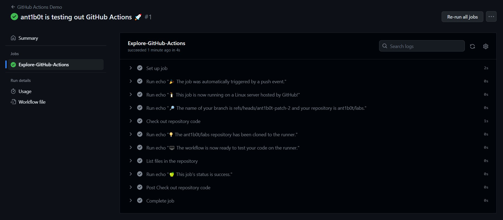
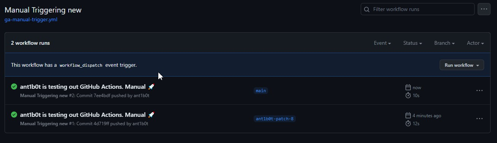
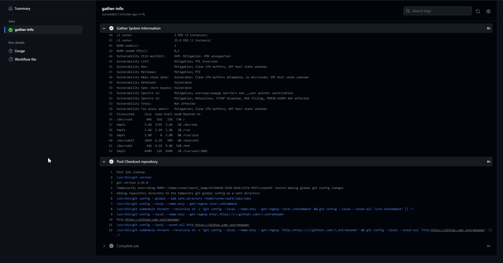

# Official Guide GitHub Actions

1. Create a `.github/workflows` directory.
2. Create a file named `github-actions-demo.yml`.
3. The result is shown on the screenshot below.




## Observations

It was unclear that I should to create the folder with workflows in root. I had to repeat 1 and 2 steps again.


# Configure a Manual Trigger

1. I created new workflow

```shell
name: Manual Triggering
run-name: ${{ github.actor }} is testing out GitHub Actions. Manual 🚀
on: [workflow_dispatch]
jobs:
  Explore-GitHub-Actions:
    runs-on: ubuntu-latest
    steps:
      - run: echo "🎉 Workflow is triggered manually. 123123"
```

2. I can not to find `Run workflow` button. I found that I need to merge the workflow into the default branch. After merging changes into `main` branch, I ran workflow successfully.



# Gather System Information

1. I create a file named `github-actions-system-info.yml`

2. I added a new job

```shell
name: Gather System Information

on: [push]

jobs:
  gather-info:
    runs-on: ubuntu-latest

    steps:
      - name: Checkout repository
        uses: actions/checkout@v2

      - name: Gather System Information
        run: |
          # Display OS and kernel information
          uname -a
          # Display memory information
          free -h
          # Display CPU information
          lscpu
          # Display disk usage information
          df -h
          # Add any other commands to gather more system information
```

2. Results contains comprehensive system information

