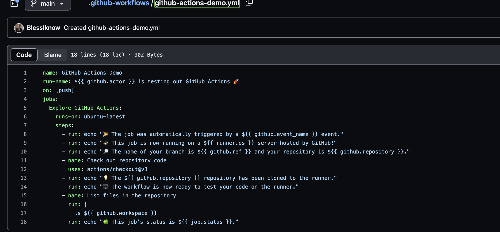
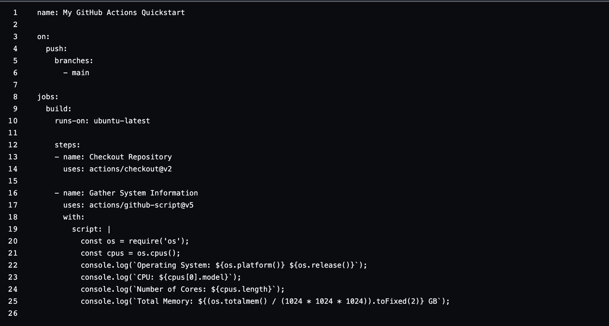

# CI/CD Lab - GitHub Actions

## Task 1: Creating my GitHub Actions Pipeline

### 1. steps you followed

- I went to this link (https://docs.github.com/en/actions/quickstart).
- I Created a .github/workflows directory directly on Github
- In the .github/workflows directory, I created a file named github-actions-demo.yml
- I Copied contents from the tutorial into the yml file.
- I commited the changes to the repo.

#

#

## Task 2: Gathering System Information and Manual Triggering

